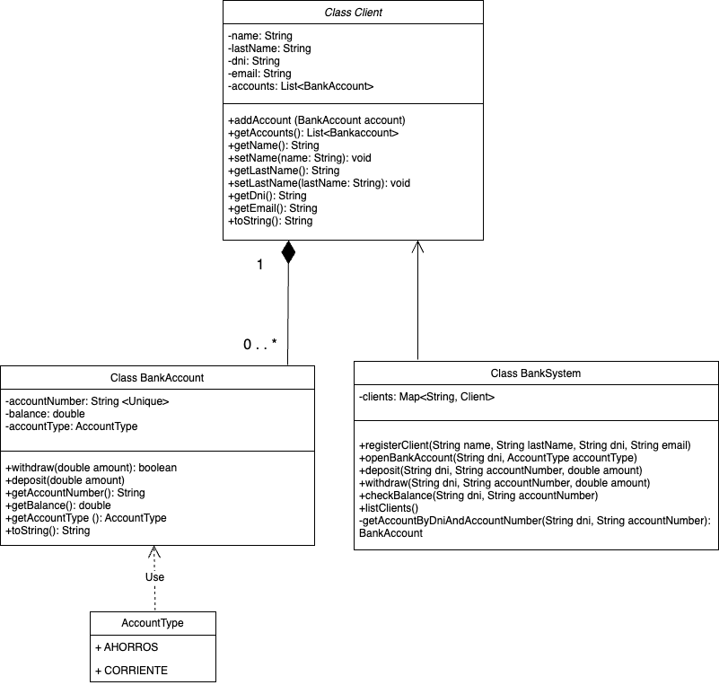

# Banking Project

Este es un sistema bancario en desarrollo, implementado en Java, con el objetivo de gestionar clientes, cuentas bancarias y realizar operaciones básicas como depósitos, retiros y consultas de saldo. El sistema está diseñado con principios de Programación Orientada a Objetos (POO) y utiliza una estructura modular que facilita la gestión y expansión de funcionalidades.

## Estado del Proyecto

**En desarrollo**: Este proyecto está en una fase temprana y está en proceso de agregar más funcionalidades y mejoras. Actualmente, el sistema soporta las siguientes características:

- Registro de clientes.
- Apertura de cuentas bancarias.
- Depósitos y retiros en cuentas bancarias.
- Consulta de saldo de cuentas bancarias.
- Listado de clientes y sus cuentas bancarias.

## Estructura del Proyecto

El proyecto consta de las siguientes clases principales:

- **Client.java**: Representa a un cliente del sistema bancario. Contiene atributos como nombre, apellido, DNI y email, así como métodos para acceder a sus cuentas bancarias.

- **BankAccount.java**: Representa una cuenta bancaria con un número de cuenta, saldo y tipo de cuenta (Ahorros o Corriente). Incluye métodos para realizar depósitos y retiros.

- **BankSystem.java**: Gestiona las operaciones principales del sistema bancario, como registrar clientes, abrir cuentas, realizar depósitos y retiros, y consultar saldos.

- **Main.java**: Interfaz de usuario basada en consola para interactuar con el sistema bancario.

## Funcionalidades Implementadas

- **Registrar un cliente**: Permite agregar un nuevo cliente al sistema con su nombre, apellido, DNI y email.
- **Abrir una cuenta bancaria**: Un cliente puede abrir una cuenta de tipo Ahorros o Corriente.
- **Depositar dinero**: Permite realizar depósitos en cuentas bancarias.
- **Retirar dinero**: Permite realizar retiros de cuentas bancarias con restricciones basadas en el tipo de cuenta.
- **Consultar saldo**: Permite consultar el saldo actual de una cuenta bancaria.
- **Listar clientes y cuentas**: Muestra todos los clientes registrados junto con sus cuentas bancarias.

## Requisitos

- **Java 8 o superior**.
- **MySQL**

## Uso

El sistema se ejecuta a través de un menú interactivo en la consola. Las opciones disponibles incluyen registrar clientes, abrir cuentas, depositar dinero, retirar dinero, consultar saldos y listar clientes y cuentas.

## Estado Actual

Este sistema está en desarrollo y algunas funcionalidades adicionales, como la persistencia de datos en una base de datos MySQL, todavía no están implementadas. Planeo seguir trabajando en el proyecto para agregar nuevas características y mejorar la estabilidad y usabilidad.

## Diagrama de Clases UML

Diagrama de clases UML del sistema bancario:

